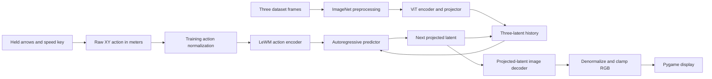

# Interactive PushBox World Simulator Implementation Plan

> This is an execution plan. Implement it task by task and mark each checkbox as it is completed. Keep changes on the `hpc` branch and do not modify or command the physical robot.

## Goal

Build an interactive, action-conditioned PushBox simulator that samples the same held-arrow controls used during data collection, advances the trained LeWM model at the original 5 Hz control rate, decodes each predicted latent into a 224×224 RGB image, and displays the predicted consequence in a focused Pygame window.

The first usable version is an offline learned simulator. It initializes from three consecutive frames in the merged dataset and then evolves entirely in latent space. It does not contact ROS, the RealSense camera, or the Trossen arm.

## Source of truth

The implementation belongs in `/scratch/cw5167/workspace/le-wm`. The control and data contracts come from `/scratch/cw5167/workspace/wm_data_collection`:

- `scripts/collector_core.py`: arrow-to-action math.
- `scripts/pygame_input.py`: held-key, speed-selection, and focus-safety behavior.
- `scripts/collect_keyboard_xy.py`: 5 Hz action/observation timing and causal alignment.
- `scripts/run_keyboard_collection.sh`: operator-facing key mapping.
- `dataset_spec.md`: HDF5 schema and episode semantics.

The model contracts come from `le-wm`:

- `jepa.py`: projected latent encoding and autoregressive prediction.
- `module.py`: action encoder and three-frame conditional predictor.
- `train.py` and `utils.py`: image/action preprocessing and deterministic episode split.
- `train_decoder.py` and `image_decoder.py`: post-hoc latent-to-image decoder.
- `config/train/pushbox.yaml`: `history_size=3`, 192-D latent, and training seed.

## Current artifacts and known constraints

- Dataset: `$STABLEWM_HOME/datasets/pushbox_pilot_train.h5`.
- Dataset size: 227 episodes, 74,531 rows, and 73,850 valid four-frame clips.
- Collection rate: 5 Hz, so one action advances the learned world by 0.2 seconds.
- Raw action: `[delta_x, delta_y]` in meters, shape `(2,)`, maximum norm 0.010 m.
- Arrow mapping: `UP/DOWN -> +X/-X`; `LEFT/RIGHT -> +Y/-Y`.
- Speed keys: `1/2/3 -> 0.0025/0.005/0.010` m per step.
- Diagonals are normalized to the selected magnitude; opposing arrows cancel.
- World-model checkpoint target: `$STABLEWM_HOME/checkpoints/pushbox/lewm/weights_epoch_150.pt`, or an earlier checkpoint selected from validation saturation.
- Projected model latent: 192-D, three-frame history.
- Image shape: ImageNet-normalized `(3, 224, 224)` internally; RGB `uint8` for display.

The current decoder sbatch uses `--latent cls`. That decoder is useful as a reconstruction probe, but it is not the renderer for an autoregressive rollout. `JEPA.encode()` applies `model.projector` to the encoder CLS token, and `JEPA.predict()` returns the same projected/planning latent space after `pred_proj`. The simulator must therefore use a separate decoder trained with `--latent proj` and must fail fast if given a CLS decoder.

Training also normalizes actions using statistics computed from training episodes only, but those statistics are not currently stored beside the portable world-model checkpoint. The simulator must reproduce and persist those exact statistics before inference. For the current split, a useful sanity check is:

```text
training rows: 67080
action mean:   [ 0.0008266356, -0.00008000344]
action std:    [ 0.00364744,    0.00387403   ]  # torch sample std
```

Do not hard-code these numbers as the implementation source of truth. Recompute them from the dataset and split settings, then store them in a versioned runtime manifest. Use the values above only to catch a wrong split or action column.

## Architecture



Keep the headless model engine separate from Pygame. Unit tests and offline rollout evaluation must be able to run without a display. The Pygame app is only an input/rendering adapter around the tested engine.

## Proposed file layout

```text
le-wm/
├── interactive_pushbox.py
├── evaluate_pushbox_simulator.py
├── pushbox_sim/
│   ├── __init__.py
│   ├── artifacts.py
│   ├── controls.py
│   ├── engine.py
│   ├── seeds.py
│   └── ui.py
├── scripts/
│   ├── build_pushbox_runtime_manifest.py
│   └── train_pushbox_projected_decoder.sbatch
└── tests/
    ├── test_pushbox_artifacts.py
    ├── test_pushbox_controls.py
    ├── test_pushbox_engine.py
    └── test_pushbox_seeds.py
```

Do not add a new package manager or install packages globally. PyTorch, stable-worldmodel, h5py, NumPy, and Pygame are already present in the repository environment. Keep any optional display transport outside the MVP.

## Runtime contracts

### `RuntimeManifest`

Implement a versioned JSON manifest with at least these fields:

```json
{
  "schema_version": 1,
  "world_model_checkpoint": "pushbox/lewm/weights_epoch_150.pt",
  "world_model_sha256": "...",
  "decoder_checkpoint": "pushbox/lewm/decoder_proj/decoder.pt",
  "decoder_sha256": "...",
  "decoder_latent": "proj",
  "dataset": "pushbox_pilot_train",
  "dataset_rows": 74531,
  "dataset_episodes": 227,
  "history_size": 3,
  "latent_dim": 192,
  "action_dim": 2,
  "frameskip": 1,
  "tick_hz": 5.0,
  "train_fraction": 0.9,
  "split_seed": 3072,
  "split_search_trials": 50000,
  "validation_episode_indices": [],
  "action_mean": [0.0, 0.0],
  "action_std": [1.0, 1.0],
  "image_mean": [0.485, 0.456, 0.406],
  "image_std": [0.229, 0.224, 0.225],
  "action_magnitudes_m": [0.0025, 0.005, 0.01],
  "action_axes": {"up": "+x", "down": "-x", "left": "+y", "right": "-y"}
}
```

Paths stored in the manifest are relative to `$STABLEWM_HOME/checkpoints/` or `$STABLEWM_HOME/datasets/`, matching stable-worldmodel conventions. Record hashes for model files because a decoder paired with a different world-model checkpoint is not a valid renderer.

### `SeedContext`

Each reset seed must contain:

- Three consecutive raw RGB frames from one episode.
- The first two aligned raw actions, `a[t]` and `a[t+1]`.
- Episode index, starting step, and global row indices.
- The third raw frame for the initial display.

The causal contract is `observation[t] + action[t] -> observation[t+1]`. On the first interactive step, append the user's new `action[t+2]` to the two seed actions and ask the predictor for the final next-latent output.

### `PushBoxSimulatorEngine`

Expose a small, display-independent API:

```python
class PushBoxSimulatorEngine:
    @classmethod
    def from_manifest(cls, manifest_path, device="cuda", amp_dtype="bfloat16"): ...

    def reset(self, seed: SeedContext) -> "StepResult": ...
    def step(self, raw_action_xy: np.ndarray) -> "StepResult": ...
    def state_dict(self) -> dict: ...
```

`StepResult` should include the rendered RGB frame, raw and normalized action, simulation step/time, inference latency, seed identity, and whether the frame is ground truth or predicted.

The engine state is:

- A deque of exactly three projected latents.
- A deque of exactly two prior normalized actions.
- Current seed metadata and predicted step counter.
- An optional bounded snapshot history for reset/export, not for model input.

For each step:

1. Validate the raw action is finite, shape `(2,)`, and norm no greater than 0.010 m plus a small floating-point tolerance.
2. Normalize with the manifest's train-only mean/std.
3. Form an action history of the two previous actions plus the new action.
4. Run `model.action_encoder()` on shape `(1, 3, 2)`.
5. Run `model.predict(latent_history, action_embeddings)` and take `[:, -1]`.
6. Append the predicted latent directly to the latent deque. Never decode and re-encode it.
7. Decode the new projected latent, undo ImageNet normalization, clamp to `[0, 1]`, convert to RGB `uint8`, and return it.
8. Append the new normalized action to the action deque.

Use `model.eval()`, `decoder.eval()`, and `torch.inference_mode()`. Start with deterministic float32 as the correctness reference. Enable CUDA bfloat16 only after comparing its output and latency against float32.

## Task 1: Freeze control, preprocessing, and artifact contracts

**Files:**

- Create `pushbox_sim/controls.py`.
- Create `pushbox_sim/artifacts.py`.
- Create `tests/test_pushbox_controls.py`.
- Create `tests/test_pushbox_artifacts.py`.
- Refactor `utils.py` only if necessary to share train-only statistics without changing current training behavior.

- [ ] Port the dependency-light held-arrow state from the collection repository. Preserve exact axis signs, diagonal normalization, opposing-key cancellation, speed levels, and focus-loss/release behavior.
- [ ] Keep the simulator implementation independent of ROS, Trossen, OpenCV, and the collection repository's Python path.
- [ ] Add table-driven tests for zero action, four cardinal actions, four diagonals, all three speeds, opposing arrows, focus loss, and focus regain while an arrow remains held.
- [ ] Add a parity test whose expected values are copied from `wm_data_collection/tests/test_collector_core.py` and `test_pygame_input.py`.
- [ ] Implement `RuntimeManifest.load()`, `validate()`, and `resolve_paths()`.
- [ ] Reject an unknown schema version, `decoder_latent != "proj"`, non-positive std, wrong history/latent/action dimensions, missing artifacts, checkpoint hash mismatches, or a rate other than 5 Hz for this model.
- [ ] Factor a pure `compute_column_stats(dataset, column, episode_indices)` helper so training and manifest creation use the same unbiased standard deviation.
- [ ] Verify that refactoring does not alter the current split, action normalization, or training loader output.

Run:

```bash
PYTHONPYCACHEPREFIX=/tmp/lewm-pycache \
  .venv/bin/python -m pytest -q \
  tests/test_pushbox_controls.py tests/test_pushbox_artifacts.py
```

Expected: all contract tests pass without CUDA or a display.

## Task 2: Produce a projected-latent decoder artifact

**Files:**

- Modify `train_decoder.py` to save explicit, versioned metadata.
- Create `scripts/train_pushbox_projected_decoder.sbatch`.
- Extend `tests/test_pushbox_artifacts.py` with decoder-loading tests.

- [ ] Preserve the existing CLS decoder output as a reconstruction baseline; do not overwrite `$STABLEWM_HOME/checkpoints/pushbox/lewm/decoder/decoder.pt`.
- [ ] Train the simulator decoder with `--latent proj` and output it to `$STABLEWM_HOME/checkpoints/pushbox/lewm/decoder_proj/`.
- [ ] Make decoder validation episode-atomic using the same split seed and validation episodes as world-model training. A random frame split leaks nearly identical frames across train/validation.
- [ ] Save `schema_version`, `latent_type`, `latent_dim`, decoder architecture, ImageNet stats, source world-model checkpoint, source checkpoint hash, split metadata, step, and `state_dict` in `decoder.pt`.
- [ ] Add a single `load_decoder_checkpoint()` implementation used by both evaluation and the simulator. Keep backward compatibility with the current `{state_dict, args, step}` format only when the caller explicitly supplies the missing metadata.
- [ ] Fail if a projected decoder is paired with a different world-model checkpoint.
- [ ] Continue logging reconstruction loss, held-out PSNR, and image grids to W&B.

The sbatch command should be equivalent to:

```bash
python train_decoder.py \
  --checkpoint pushbox/lewm/weights_epoch_150.pt \
  --dataset pushbox_pilot_train \
  --latent proj \
  --steps 20000 \
  --out "$STABLEWM_HOME/checkpoints/pushbox/lewm/decoder_proj"
```

Submit only after selecting the world-model epoch:

```bash
sbatch scripts/train_pushbox_projected_decoder.sbatch
```

Decoder quality gate:

- No non-finite training or validation values.
- Held-out reconstruction PSNR is at least 18 dB and beats a per-channel-mean image baseline by at least 50% MSE.
- The pusher, box, workspace boundaries, and gross object locations are recognizable in held-out grids.
- Record CLS-versus-projected decoder metrics; the projected decoder is allowed to be blurrier, but it must remain usable.

If this gate fails, improve the decoder before building the UI. Do not hide a bad decoder behind interface work.

## Task 3: Build the reproducible runtime manifest

**Files:**

- Create `scripts/build_pushbox_runtime_manifest.py`.
- Extend `tests/test_pushbox_artifacts.py`.

- [ ] Load the HDF5 dataset with `frameskip=1`, `num_steps=4`, and cached actions.
- [ ] Reproduce `balanced_episode_split(train_fraction=0.9, seed=3072, search_trials=50000)`.
- [ ] Compute action mean/std from every row in training episodes only, exactly as training did.
- [ ] Capture validation episode indices and dataset row/episode counts.
- [ ] Read model dimensions from the saved world-model `config.json`; do not duplicate them in code.
- [ ] Read and validate projected-decoder metadata.
- [ ] Hash both checkpoint files and write the manifest atomically.
- [ ] Print a human-readable summary including resolved paths and action statistics.
- [ ] Add `--verify-only` to validate an existing manifest without rewriting it.

Run:

```bash
export STABLEWM_HOME=/scratch/cw5167/stable-wm
.venv/bin/python scripts/build_pushbox_runtime_manifest.py \
  --world-model pushbox/lewm/weights_epoch_150.pt \
  --decoder pushbox/lewm/decoder_proj/decoder.pt \
  --dataset pushbox_pilot_train \
  --output "$STABLEWM_HOME/checkpoints/pushbox/lewm/simulator.json"
```

Expected: the summary reports 227 episodes, 74,531 rows, history 3, action dimension 2, projected latent dimension 192, and action statistics close to the sanity values above.

## Task 4: Implement deterministic seed loading

**Files:**

- Create `pushbox_sim/seeds.py`.
- Create `tests/test_pushbox_seeds.py`.

- [ ] Implement a seed provider over `HDF5Dataset` or direct HDF5 slices without loading pixels for the entire 11.23 GB file.
- [ ] Enumerate only starts with three consecutive observations inside one episode.
- [ ] Default to validation episodes so interactive behavior is not demonstrated only on training data.
- [ ] Support `--seed-split val|train|all`, `--episode`, `--step`, and deterministic `--seed` selection.
- [ ] Return raw RGB frames for display and ImageNet-normalized tensors for encoding.
- [ ] Return only the first two historical actions; the third action must come from the user.
- [ ] Reject terminal/padded contexts, cross-episode slices, invalid indexes, wrong image/action shapes, and non-finite actions.
- [ ] Test exact episode/step boundaries and causal action alignment using a tiny temporary HDF5 fixture.

Run:

```bash
PYTHONPYCACHEPREFIX=/tmp/lewm-pycache \
  .venv/bin/python -m pytest -q tests/test_pushbox_seeds.py
```

Expected: all tests pass on CPU without opening the full image dataset.

## Task 5: Implement and test the headless rollout engine

**Files:**

- Create `pushbox_sim/engine.py`.
- Create `tests/test_pushbox_engine.py`.

- [ ] Implement manifest-driven loading through `swm.wm.utils.load_pretrained()` and `load_decoder_checkpoint()`.
- [ ] Encode all three seed frames in one batch, apply `model.projector`, and initialize the latent deque.
- [ ] Normalize the two historical actions from the seed and initialize the action deque.
- [ ] Implement one action-conditioned step exactly as defined in the runtime contract.
- [ ] Preserve predicted latents directly across steps; do not feed rendered pixels back through the encoder.
- [ ] Add reset, deterministic seed replay, bounded history, and rollout export metadata.
- [ ] Add clear errors for NaNs, shape drift, invalid action magnitudes, missing CUDA when explicitly requested, and artifact mismatches.
- [ ] Add CPU unit tests with tiny fake encoder/predictor/decoder modules that verify action ordering, deque shifting, reset determinism, and output conversion.
- [ ] Add a real-checkpoint GPU smoke test marked `integration` so it is skipped when artifacts or CUDA are unavailable.

The most important alignment test should prove:

```text
seed latents:   z[t], z[t+1], z[t+2]
seed actions:   a[t], a[t+1]
user action:                    a[t+2]
prediction:                              z[t+3]
```

Run unit tests:

```bash
PYTHONPYCACHEPREFIX=/tmp/lewm-pycache \
  .venv/bin/python -m pytest -q tests/test_pushbox_engine.py -m "not integration"
```

Run the real artifact smoke test on a GPU node:

```bash
export STABLEWM_HOME=/scratch/cw5167/stable-wm
.venv/bin/python -m pytest -q tests/test_pushbox_engine.py -m integration
```

Expected: one reset and at least 100 mixed-direction autoregressive steps produce finite 224×224 RGB frames without growing memory.

## Task 6: Add quantitative offline rollout evaluation

**Files:**

- Create `evaluate_pushbox_simulator.py`.
- Add focused helper tests to `tests/test_pushbox_engine.py`.

- [ ] Evaluate projected-decoder reconstruction separately from dynamics prediction. This distinguishes decoder blur from world-model error.
- [ ] Evaluate one-step predictions on held-out, moving-action clips.
- [ ] Compare correct actions with shuffled actions. Correct-action latent MSE must be lower on average.
- [ ] Compare predicted next frames with a copy-last-frame baseline on moving-action clips.
- [ ] Evaluate teacher-seeded autoregressive rollouts at 1, 5, 10, and 25 steps using recorded future actions.
- [ ] Report normalized-pixel MSE, RGB PSNR, projected-latent MSE, and p50/p95 inference latency.
- [ ] Save JSON/CSV metrics plus side-by-side ground-truth/prediction grids and MP4 rollouts.
- [ ] Add an eight-direction counterfactual grid from the same seed at all three speeds, plus zero action.
- [ ] Use deterministic sample lists and store episode/step identifiers in every output.

Run on a GPU node:

```bash
export STABLEWM_HOME=/scratch/cw5167/stable-wm
.venv/bin/python evaluate_pushbox_simulator.py \
  --manifest "$STABLEWM_HOME/checkpoints/pushbox/lewm/simulator.json" \
  --split val \
  --max-clips 2048 \
  --horizons 1 5 10 25 \
  --output outputs/pushbox-simulator-eval
```

World-model quality gate:

- Correct-action projected-latent MSE is lower than shuffled-action MSE on moving validation clips.
- The one-step model beats copy-last RGB MSE on moving validation clips.
- All 25-step rollouts remain finite.
- Counterfactual directions do not all collapse to the same frame.
- On H200, p95 encode/predict/decode time is below the 200 ms control interval.
- A human review confirms that direction changes have plausible consequences and identifies the horizon at which drift becomes unacceptable.

If the model fails the action-sensitive gates, do not interpret a visually smooth decoder as a working simulator. Revisit dataset balance, action normalization, training saturation, or predictor quality first.

## Task 7: Implement the Pygame interface

**Files:**

- Create `pushbox_sim/ui.py`.
- Create `interactive_pushbox.py`.
- Extend `tests/test_pushbox_controls.py` with event-translation tests.

Use these controls:

| Key | Behavior |
|---|---|
| Arrow keys | Same held base-frame action as collection |
| `1`, `2`, `3` | Select 2.5, 5, or 10 mm per simulated step |
| `SPACE` | Pause/resume 5 Hz simulation |
| `.` | Advance exactly one step while paused |
| `r` | Reset the current dataset seed |
| `n` / `p` | Next/previous deterministic seed |
| `s` | Save rollout frames, actions, seed metadata, and MP4 |
| `q` or window close | Quit without affecting any job or robot |

- [ ] Start paused on the third ground-truth seed frame and clearly label it `GROUND TRUTH SEED`.
- [ ] Once stepped, label frames `MODEL PREDICTION` and show simulated time/step.
- [ ] Sample held arrows at 5 Hz. Render the latest frame and pump events at 30 Hz.
- [ ] A zero held action still advances the model when running; pausing is the only way to freeze time.
- [ ] Normalize diagonal magnitude exactly as the collector does.
- [ ] On focus loss, pause, clear held keys, and require all arrows released after focus returns.
- [ ] Never emit catch-up actions after a slow inference step. Advance one model step, display it, and show a latency warning.
- [ ] Overlay speed, raw action, selected seed episode/step, predicted horizon, instantaneous/p95 latency, device, world checkpoint, and decoder type.
- [ ] Keep inference synchronous for the first version. Add a worker only if measured UI blocking is unacceptable; never allow more than one queued action because stale held-key commands change semantics.
- [ ] Save outputs below `outputs/pushbox-simulator/<timestamp>/` without overwriting earlier runs.
- [ ] Add `--device`, `--manifest`, `--seed-split`, `--episode`, `--step`, `--start-paused`, and `--amp` CLI options.
- [ ] Add `--headless-steps N --action-script path.json` for deterministic smoke tests without Pygame or a display.

Run a headless smoke test first:

```bash
export STABLEWM_HOME=/scratch/cw5167/stable-wm
SDL_VIDEODRIVER=dummy .venv/bin/python interactive_pushbox.py \
  --manifest "$STABLEWM_HOME/checkpoints/pushbox/lewm/simulator.json" \
  --device cuda \
  --headless-steps 100 \
  --action-script tests/fixtures/pushbox_actions.json
```

Then run interactively from a GPU environment with a valid `$DISPLAY`:

```bash
export STABLEWM_HOME=/scratch/cw5167/stable-wm
.venv/bin/python interactive_pushbox.py \
  --manifest "$STABLEWM_HOME/checkpoints/pushbox/lewm/simulator.json" \
  --device cuda \
  --seed-split val
```

HPC display gate:

- Confirm `echo "$DISPLAY"` is non-empty on the process that launches Pygame.
- Use an interactive GPU allocation with X11 forwarding or the site's supported remote desktop; do not run the UI as a disconnected sbatch job.
- If the cluster cannot forward a Pygame window reliably, keep the engine unchanged and add a separate thin local client/server adapter in a later task. Do not mix networking into the first correctness pass.

## Task 8: Documentation, regression checks, and handoff

**Files:**

- Modify `README.md` with setup, artifact, evaluation, and launch commands.
- Keep this plan updated with completed checkboxes and measured gates.

- [ ] Document that the simulator is a learned prediction, not ground-truth physics.
- [ ] Document that resets seed from recorded observations; arbitrary scene construction is out of scope.
- [ ] Document current reliable rollout horizon from Task 6 instead of claiming indefinite accuracy.
- [ ] Document projected-versus-CLS decoder compatibility.
- [ ] Document the exact action mapping and 5 Hz timing.
- [ ] Document X11/remote-display requirements and the headless fallback.
- [ ] Verify no ROS, camera, or robot imports occur in the simulator path.
- [ ] Verify no global package installation or writes outside the repository and `$STABLEWM_HOME` artifact/output directories.

Run the full regression suite:

```bash
PYTHONPYCACHEPREFIX=/tmp/lewm-pycache \
  .venv/bin/python -m py_compile \
  interactive_pushbox.py evaluate_pushbox_simulator.py pushbox_sim/*.py

PYTHONPYCACHEPREFIX=/tmp/lewm-pycache \
  .venv/bin/python -m pytest -q tests -m "not integration"

bash -n scripts/train_pushbox_projected_decoder.sbatch
git diff --check
git status --short
```

Expected: compilation, unit tests, shell syntax, and whitespace checks pass; only intended simulator files are changed.

## Definition of done

The simulator is complete only when all of the following are true:

- A projected-latent decoder is trained, validated, and paired to the selected world-model checkpoint.
- A versioned manifest reproduces the exact train-only action normalization and validates all artifact identities.
- Dataset seeds preserve episode boundaries and causal action alignment.
- Headless engine tests prove the three-latent/two-prior-action state transition.
- Offline validation shows the model is action-sensitive and beats the specified baselines on held-out moving clips.
- A 100-step mixed-action rollout stays finite and memory-stable.
- H200 p95 inference latency is below 200 ms, or the UI clearly runs below real-time without catch-up.
- Pygame controls match collection for axes, speed, diagonals, opposing keys, and focus behavior.
- The UI starts from a labeled ground-truth seed and clearly labels all subsequent model predictions.
- Saved rollouts include raw actions, seed identity, checkpoint/decoder hashes, timing, and frames.
- No simulator code can command the robot or depend on ROS.

## Risks and mitigations

| Risk | Mitigation |
|---|---|
| CLS decoder is used on predicted projected latents | Manifest requires `decoder_latent=proj` and matching checkpoint hash |
| Raw keyboard actions are fed to a model trained on z-scores | Persist exact train-only mean/std and test normalization |
| Seed actions are off by one | Encode the causal alignment in `SeedContext` and a dedicated engine test |
| Multi-step drift produces plausible-looking but incorrect images | Separate decoder reconstruction from dynamics metrics; report horizon curves |
| Model ignores action because many frames change slowly | Correct-vs-shuffled and moving-only evaluation gates |
| Decoder blur is mistaken for dynamics failure | Report oracle reconstruction alongside predicted rollouts |
| Predicted pixels are repeatedly re-encoded | Keep projected latents as the authoritative recurrent state |
| Focus loss leaves a motion key active | Reuse collector focus/release state behavior and auto-pause |
| Slow inference queues stale actions | Never catch up and never queue more than one step |
| Headless HPC node cannot open Pygame | Require a valid display for UI; retain headless engine/evaluation path |
| Checkpoint selected before training saturation is understood | Choose epoch from W&B validation curves before training projected decoder |

## Explicit non-goals for the first version

- No physical robot, ROS, RealSense, or Trossen integration.
- No goal-conditioned planning, CEM, or policy control.
- No arbitrary image upload as a seed until dataset-seed behavior is validated.
- No browser/server deployment in the MVP.
- No online fine-tuning or weight updates.
- No claim that long autoregressive rollouts are physically correct beyond the measured validation horizon.
